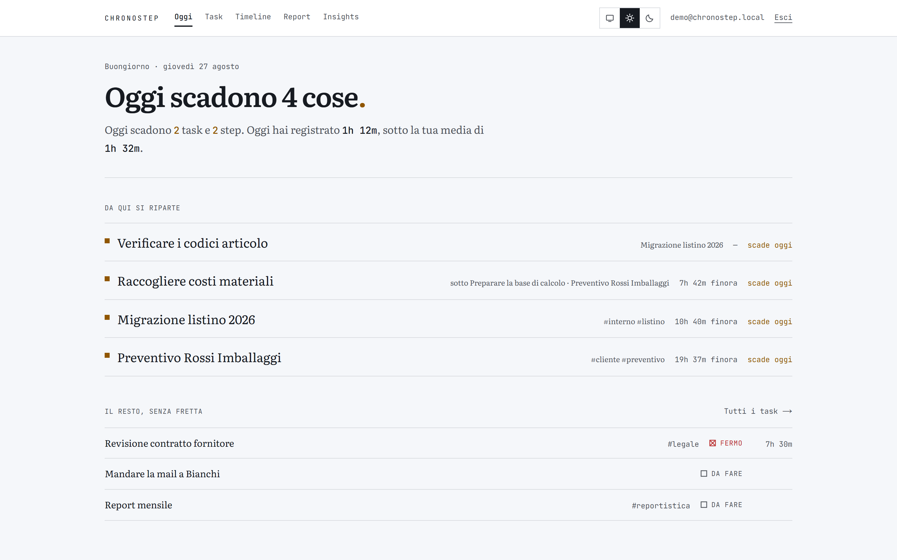
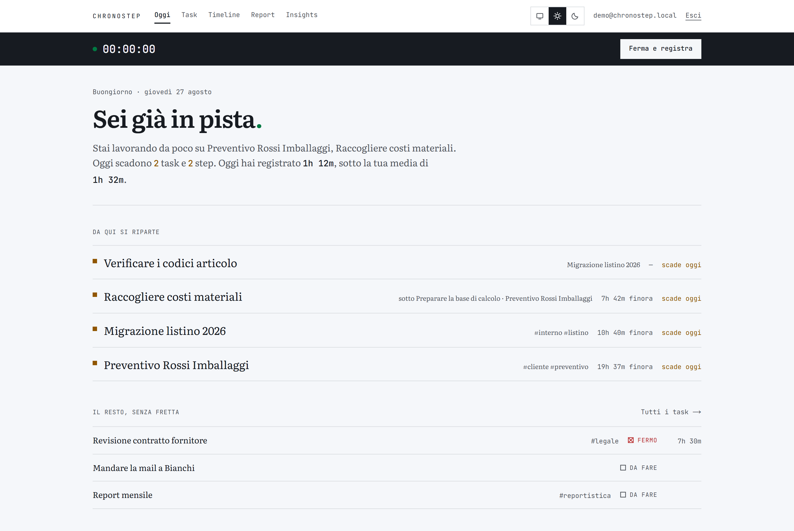
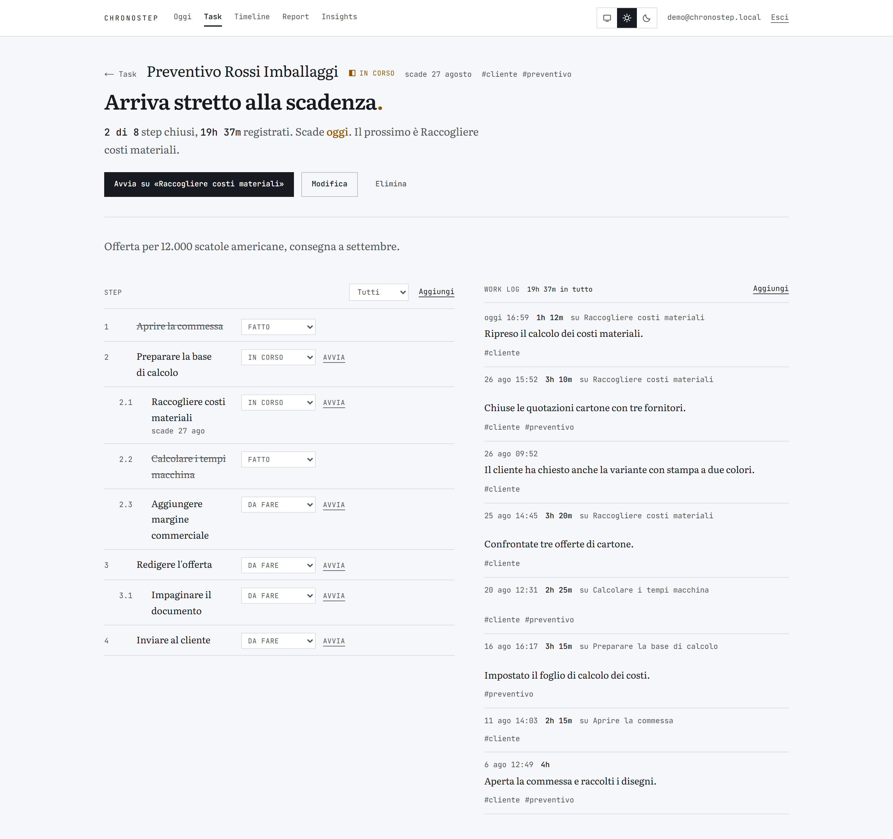
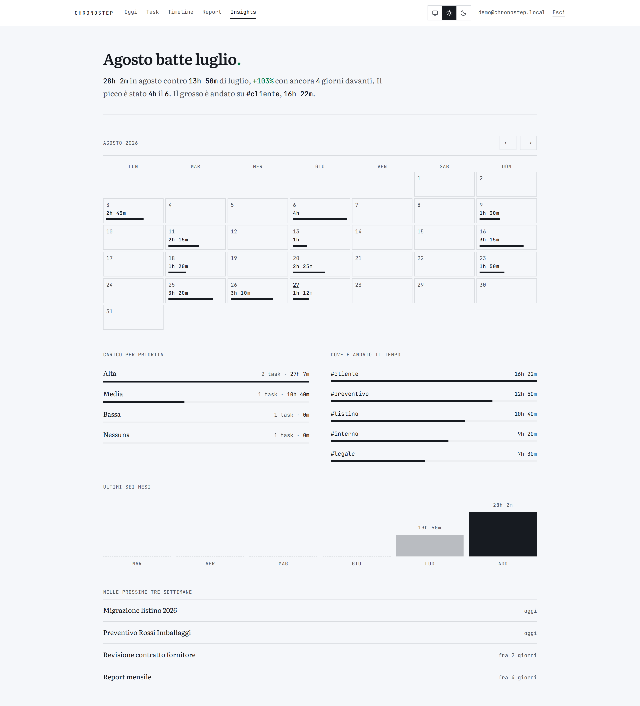
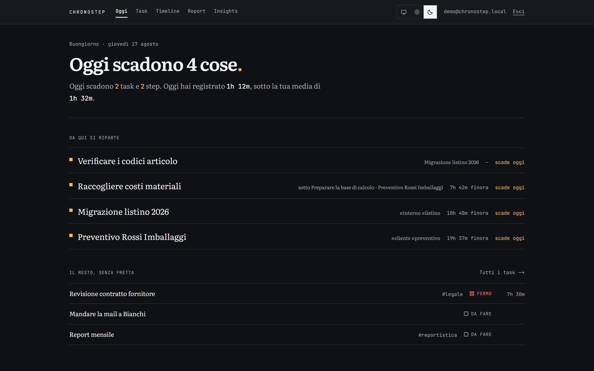
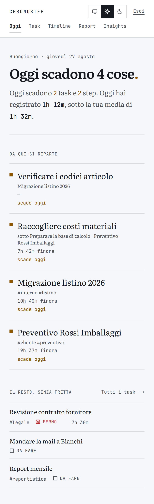

# ChronoStep

**Un diario operativo: task, step annidati e il tempo che ci hai messo davvero.**

[](https://www.gnu.org/licenses/agpl-3.0)
[](https://nextjs.org/)
[](https://firebase.google.com/)
[](https://www.typescriptlang.org/)



---

## L'idea

Un cruscotto normale ti consegna un muro di riquadri con dei numeri dentro e lascia a te
l'interpretazione. ChronoStep no: **ogni schermata apre con una conclusione** — una frase che dice
come stai messo — e la sostiene con un paragrafo in cui i numeri stanno **dentro** la frase.

> Oggi scadono 4 cose**.**
> Oggi scadono `2 task` e `2 step`. Oggi hai registrato `1h 12m`, sotto la tua media di `1h 32m`.

Il punto finale prende il colore del giudizio: verde se le cose vanno, ambra se vogliono
attenzione, rosso se sei indietro. Un numero che compare nel paragrafo non viene disegnato anche
come riquadro da qualche altra parte.

I verdetti sono calcolati da regole sui dati, non scritti a mano, e **devono poter dare cattive
notizie**: se hai un timer acceso ma tre cose scadute, il titolo parla delle tre cose scadute. Dove
i dati non bastano per un giudizio, la pagina lo dice invece di inventarne uno.

---

## Cosa fa

- **Task → Step annidati → Work log.** Un task può restare una riga sola («mandare la mail a
  Bianchi») o diventare un progetto con otto step su tre livelli. Le due cose vivono nella stessa
  lista senza che quella vuota sembri rotta.
- **Il tempo si attacca allo step, non solo al task.** Il consuntivo non dice soltanto «19h su
  questo lavoro», ma su quale pezzo di lavoro sono andate.
- **Timer globale.** Parte da una riga dell'albero e si ferma da qualunque pagina, perché la barra
  della sessione in corso è sempre a schermo — anche dopo aver cancellato il task su cui girava.



  Con una sessione aperta il verdetto cambia da solo: *"Sei già in pista."*
- **Timeline, Report, Insights.** Registro cronologico, consuntivo per task, e una mappa di calore
  del mese che concorda con i totali mensili — perché usano gli stessi bucket. Cliccando una priorità
  o un tag si apre il dettaglio di cosa c'è sotto, e la vista filtrata è linkabile.
- **Chiaro e scuro**, con interruttore a tre stati (chiaro, scuro, segui il sistema).

---

## Come si presenta

| | |
|---|---|
|  |  |
| **Dettaglio task** — l'albero degli step è piatto con una colonna di numerazione (1, 2, 2.1): a tre livelli l'annidamento vero spende quasi tutta la larghezza in rientri. | **Insights** — la quantità è disegnata come lunghezza di un filetto in inchiostro, non come riempimento colorato: il verde resta riservato al giudizio. |
|  |  |
| **Tema scuro** — l'identità non sta nel nero: sta nell'anatomia del verdetto e nella coppia serif/monospace. Il tema è solo uno scambio di token OKLCH. | **Telefono** — desktop-first, ma le righe si impilano e la navigazione scorre invece di spezzarsi. |

---

## Avvio rapido

Servono Node.js 20+ e un progetto Firebase ([piano gratuito](https://firebase.google.com/pricing)).

```bash
git clone https://github.com/GiuseppeDM98/chronostep.git
cd chronostep
npm install
cp .env.example .env      # poi riempi le quattro variabili NEXT_PUBLIC_FIREBASE_*
npm run dev
```

Le istruzioni complete stanno in [SETUP.md](./SETUP.md).

### Sviluppo contro gli emulatori

Per lavorare senza toccare dati veri — e per vedere le schermate piene invece che vuote:

```bash
npm run emulators          # Auth + Firestore in locale
npm run seed               # crea un account e dei dati d'esempio
NEXT_PUBLIC_USE_FIREBASE_EMULATOR=true npm run dev
```

Il seed stampa le credenziali. I dati sono generati **relativi a oggi**, quindi la mappa di calore
copre sempre il mese visibile e il confronto fra mesi ha sempre un mese precedente.

---

## Verifiche

Non c'è un livello server: le regole Firestore sono l'**unico** confine fra i dati di due account,
e le date sono la sorgente storica di più bug di questo progetto. Entrambe hanno una suite.

```bash
npm test              # tutto
npm run test:rules    # 32 verifiche sulle regole, nell'emulatore
npm run test:dates    # 15 verifiche × 4 fusi orari
npm run test:insights # aggregazione: pairing start/stop, bucket, totali
npm run test:verdicts # il motore dei verdetti, compreso che sappia dare cattive notizie
```

`test:rules` prova gli attacchi (un secondo account che tenta di leggere, dirottare o cancellare i
dati del primo) **e** i flussi reali dell'app, perché un giro di vite sulle regole può rompere la
cancellazione a cascata senza rompere nient'altro.

`test:dates` rigira le stesse asserzioni da quattro fusi orari: un bug di date è invisibile da
Greenwich.

---

## Modello dati

```typescript
interface Task {
  id: string;
  userId: string;
  title: string;
  description?: string;
  status: "todo" | "in_progress" | "done" | "blocked";
  priority?: "low" | "medium" | "high";
  tags?: string[];
  dueDate?: string;      // "2026-08-27" — un giorno di calendario, non un istante
  createdAt: string;     // ISO 8601
  updatedAt: string;
}

interface Step {
  id: string;
  userId: string;
  taskId: string;
  parentStepId?: string; // annidamento
  title: string;
  description?: string;
  status: "todo" | "in_progress" | "done";
  order: number;         // relativo ai FRATELLI, non globale
  dueDate?: string;
  createdAt: string;
  updatedAt: string;
}

interface WorkLog {
  id: string;
  userId: string;
  taskId: string;
  stepId?: string;
  message?: string;
  tags: string[];
  type: "start" | "stop" | "note";
  timestamp: string;         // ISO 8601: un istante
  durationMinutes?: number;
}
```

**Due tipi di data, trattati diversamente.** Una scadenza è un giorno sul calendario e si salva come
`"2026-08-27"`: non può slittare. Un timestamp è un istante, e la giornata sotto cui finisce è
quella **locale** di chi guarda. Vedi `src/lib/dates.ts`.

---

## Struttura

```
chronostep/
├── src/
│   ├── app/
│   │   ├── page.tsx            # Oggi — la home
│   │   ├── tasks/              # lista e dettaglio
│   │   ├── timeline/ report/ insights/
│   │   ├── layout.tsx          # font, tema, contratto di direzione
│   │   └── globals.css         # token OKLCH, chiaro e scuro
│   ├── components/
│   │   ├── AppShell.tsx        # navigazione + sessione in corso
│   │   ├── Verdict.tsx         # il blocco verdetto
│   │   ├── Dialog.tsx          # dialogo con trappola del focus
│   │   └── controls.tsx        # campi etichettati, bottoni con stato
│   ├── hooks/                  # auth, store, timer, tema, orologio
│   └── lib/
│       ├── verdicts.ts         # il motore dei verdetti
│       ├── dates.ts            # le due specie di data
│       ├── insights.ts         # aggregazione e pairing delle sessioni
│       └── types.ts
├── tests/                      # regole, date, aggregazione, verdetti
├── scripts/                    # seed emulatori, catture
├── firestore.rules
├── PRODUCT.md                  # verità di prodotto
└── DESIGN.md                   # il sistema visivo
```

---

## Stack

Next.js 16 (App Router, tutte le pagine client) · React 18 · TypeScript · Tailwind 3 con token
OKLCH · Firebase Auth + Firestore, solo SDK client. Nessun server, nessuna API route.

Tipografia: **Literata** per la voce umana (verdetti, prose, note) e **JetBrains Mono** per lo
strumento (durate, conteggi, date, stati, etichette dei controlli). L'alternanza fra le due è
l'identità: togli tutto il contenuto e il prodotto si riconosce ancora.

---

## Limiti noti

- `useTaskStore` legge tutti i documenti dell'utente a ogni aggiornamento: su volumi grandi va
  paginato.
- Niente sincronizzazione realtime: si legge a richiesta e si rilegge dopo ogni scrittura.
- La cancellazione a cascata non è transazionale. È divisa in blocchi per non superare il limite di
  500 operazioni di Firestore, ma un errore a metà lascia uno stato parziale.
- Il blocco delle registrazioni via `NEXT_PUBLIC_DISABLE_SIGNUPS` è un filtro dell'interfaccia, non
  un controllo: per chiuderle davvero si configura Firebase Auth.
- L'account demo mostrato nella schermata di accesso è condiviso con chiunque abbia il link.

---

## Documentazione

- [SETUP.md](./SETUP.md) — configurazione Firebase passo passo
- [PRODUCT.md](./PRODUCT.md) — utenti, scopo, vincoli, principi
- [DESIGN.md](./DESIGN.md) — token, tipografia, componenti, anti-pattern
- [AGENTS.md](./AGENTS.md) · [CLAUDE.md](./CLAUDE.md) — riferimento tecnico
- [LICENSE.md](./LICENSE.md) — AGPL-3.0

---

## Licenza

**GNU Affero General Public License v3.0.** Puoi usarlo, modificarlo e distribuirlo; se lo modifichi
e lo pubblichi come servizio web devi renderne disponibile il sorgente, e ogni opera derivata resta
sotto AGPL-3.0. Testo completo in [LICENSE.md](./LICENSE.md).
